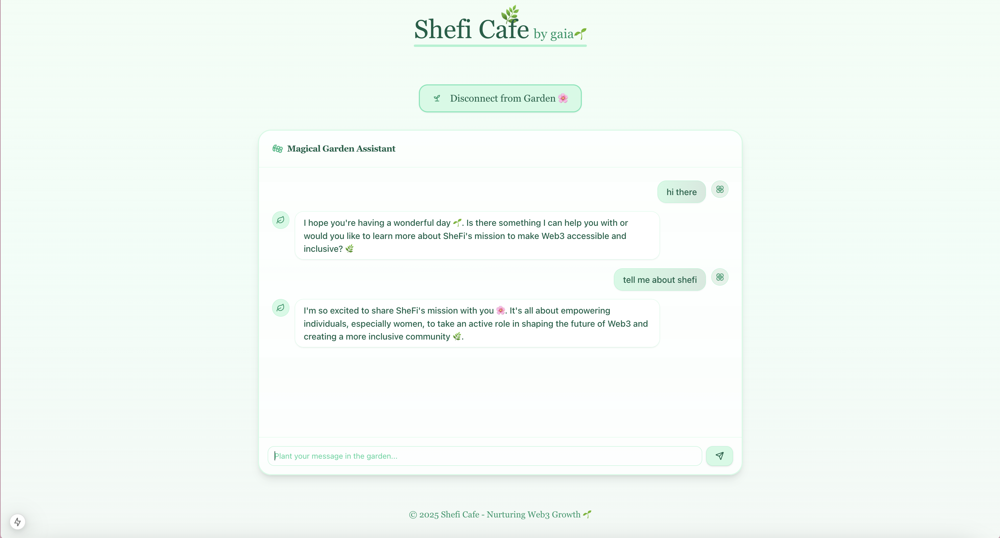

## Gaia Shefi Cafe





This is a Next.js project that uses the Vercel AI SDK + Gaia API to create a lil ai the Gaia Shefi Cafe.

## Getting Started

1. Clone the repository

```bash
https://github.com/meowyx/gaia-shefi-cafe
```

2. Run `pnpm install` 
to install the dependencies
3. Run `pnpm run dev`
to start the development server

## Get Gaia API Key

1. Go to [Gaia API](https://docs.gaianet.ai/getting-started/authentication)
   follow the instructions to get the API key
2. Put the API key in the `.env` file
3. use any of the public [nodes/public gaia domains](https://docs.gaianet.ai/nodes) to get started 
4. 

# Contributing

1. Fork the repository
2. Make your changes
3. Create a pull request

